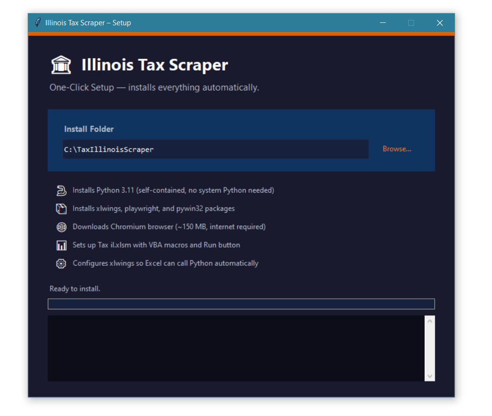
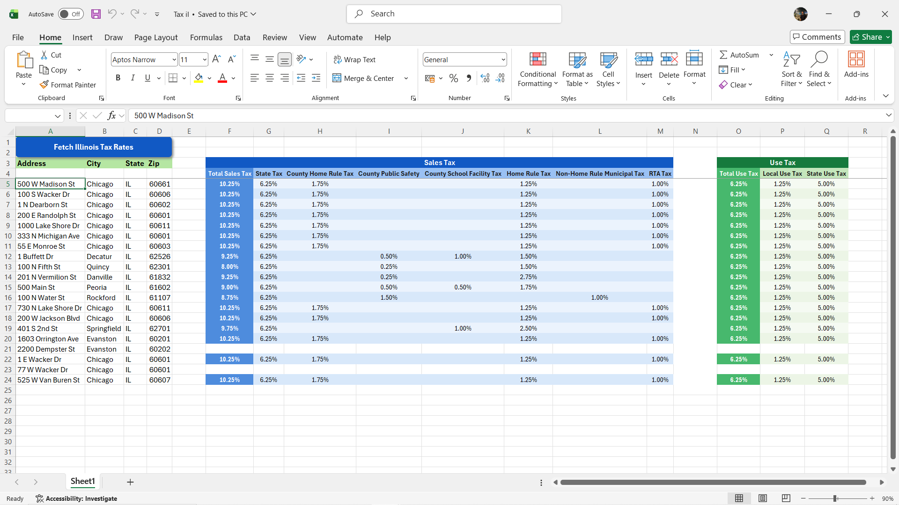
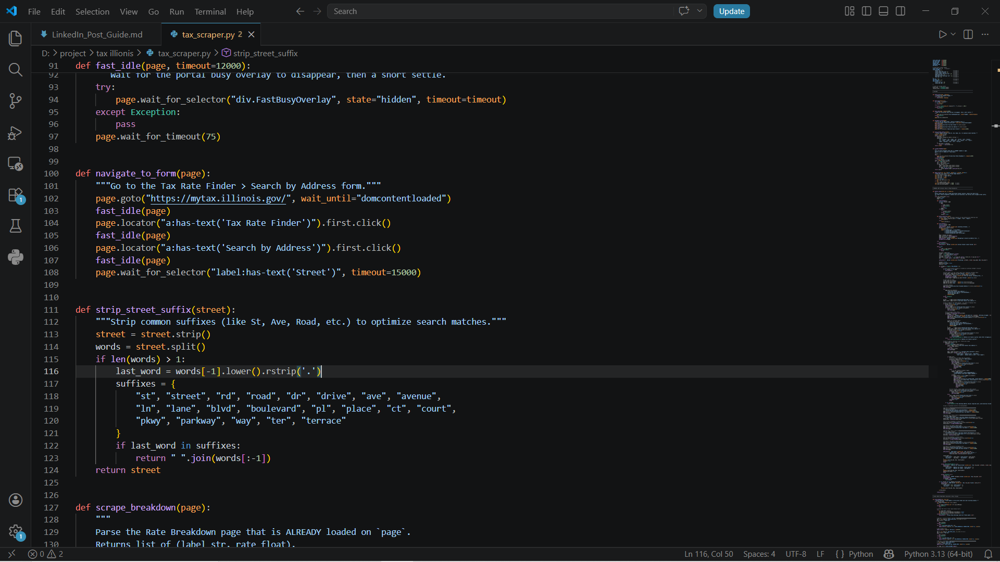

<div align="center">

# 🏛 Illinois Tax Rate Scraper

### Production-grade Python automation that bulk-queries the MyTax Illinois government portal and writes live results into a beautifully formatted Excel workbook — shipped as a zero-dependency, one-click `.EXE` for non-technical clients.

[](https://python.org)
[](https://playwright.dev)
[](https://xlwings.org)
[](https://pyinstaller.org)
[](LICENSE)

</div>

---

## 📸 Screenshots

<div align="center">

| One-Click Installer GUI | Live Excel Output |
|:---:|:---:|
|  |  |
| *Dark-themed Tkinter installer — bundles Python, Chromium & xlwings* | *Real-time zebra-striped tax rate grid across 20 Illinois addresses* |

| VS Code — Core Scraping Logic |
|:---:|
|  |
| *`strip_street_suffix()` + resilient `navigate_to_form()` — handles portal edge cases automatically* |

</div>

---

## 🎯 The Problem

A US-based real-estate client needed to look up Illinois Sales & Use Tax rates for **hundreds of property addresses** — one at a time — on the [MyTax Illinois](https://mytax.illinois.gov/) government portal. No bulk export. No API. Just a web form.

Doing this manually took **hours**, was error-prone, and required navigating complex unit-selection dialogs and address-spelling mismatches.

> **The gap between "it works on my machine" and "it works on theirs" is where most projects fail.**

This project solves both the automation *and* the last-mile delivery problem.

---

## ✨ Key Features

| Feature | Implementation |
|:---|:---|
| 🚀 **10x Parallel Workers** | Spawns up to **10 headless Playwright/Chromium** instances simultaneously using Python `threading` |
| ⚡ **~65% Faster Page Loads** | Resource interception via `page.route()` aborts all images, fonts & media — only fetches what matters |
| 🎯 **Resilient Address Matching** | Custom `strip_street_suffix()` auto-strips `St`, `Ave`, `Blvd`, etc. and retries on portal mismatch |
| 🏢 **Multi-Unit Auto-Selection** | Detects unit-selection dialogs and auto-clicks the first available record/combobox option |
| 📊 **Live Excel COM Bridge** | `xlwings` writes results back to the open workbook in **real-time** — watch the data appear row by row |
| 🎨 **Professional Excel Styling** | Merged headers, freeze panes, zebra striping, custom RGB color palette (orange Sales / green Use tax) |
| 🔁 **Smart Deduplication** | De-duplicates input addresses before scraping; maps cached results to all duplicate rows |
| 📦 **One-Click EXE Installer** | `PyInstaller` GUI bundles Python 3.11, Chromium, xlwings COM — client double-clicks, it just works |
| 🔒 **Thread-Safe Architecture** | `threading.Lock()` guards all print and Excel COM calls; `queue.Queue` decouples workers from writer |

---

## 🏗 Architecture

```
┌─────────────────────────────────────────────────────────┐
│                    Tax il.xlsm                          │
│  [Fetch Illinois Tax Rates] ← VBA button → RunPython   │
└────────────────────────┬────────────────────────────────┘
                         │ xlwings COM call
                         ▼
┌─────────────────────────────────────────────────────────┐
│               fetch_illinois_tax()  [Main Thread]       │
│  1. Read A:D addresses from Excel                       │
│  2. Deduplicate address list                            │
│  3. Write styled headers (merged, freeze-panes)         │
│  4. Spawn N worker threads (up to 10)                   │
│  5. Poll output_q → write_row() in real-time            │
└──────────┬──────────────────────────────────────────────┘
           │ queue.Queue (thread-safe)
    ┌──────┴──────┐
    ▼             ▼
[Worker 1]  ...  [Worker N]        ← threading.Thread × N
Playwright      Playwright
Chromium        Chromium
│               │
▼               ▼
MyTax Illinois Portal (mytax.illinois.gov)
- navigate_to_form()
- validate_address() + strip_street_suffix() retry
- auto unit-selection (grid rows / combobox)
- scrape Sales Tax total + 7 breakdown splits
- scrape Use Tax total + 2 breakdown splits
- back-navigate for form reuse (no re-launch overhead)
```

---

## 📂 Project Structure

```
illinois-tax-scraper/
├── tax_scraper.py          # Core engine — Playwright workers, Excel COM writer
├── setup_installer.py      # One-click Tkinter GUI installer
├── TaxScraperSetup.spec    # PyInstaller spec file
├── build.bat               # Build script — produces dist/TaxScraperSetup.exe
├── Tax il.xlsm             # Excel workbook with VBA macro + action button
├── Tax il.xlsx             # Plain version (auto-converted to .xlsm on first run)
├── docs/
│   └── screenshots/        # UI screenshots for documentation
└── .gitignore
```

---

## 🛠 Tech Stack

| Layer | Technology | Why |
|:---|:---|:---|
| **Web Automation** | [Playwright (Python)](https://playwright.dev/python/) | Async-capable, reliable Chromium control; better than Selenium for modern SPAs |
| **Excel Integration** | [xlwings](https://xlwings.org/) + VBA | Bidirectional live COM bridge; real-time cell writes without file save/reload |
| **Concurrency** | `threading` + `queue.Queue` | COM objects are not `asyncio`-safe; thread-based workers with a thread-safe output queue |
| **GUI Installer** | `tkinter` + `ttk` | Ships in Python stdlib — zero extra dependencies for the installer itself |
| **Compiler** | [PyInstaller](https://pyinstaller.org/) | Single-file EXE with bundled assets; `--add-data` embeds `tax_scraper.py` + `.xlsm` |
| **Distribution** | Embedded Python 3.11 | Self-contained `python-embed-amd64.zip` — no global Python install required |

---

## 🚀 Getting Started

### For Developers (from source)

**Prerequisites:** Python 3.10+, pip

```bash
# 1. Clone the repo
git clone https://github.com/Darshil-yup/Tax_fetcher.git
cd Tax_fetcher

# 2. Install dependencies
pip install playwright xlwings pywin32

# 3. Install Chromium
playwright install chromium

# 4. Open Tax il.xlsm in Excel and click the orange "Fetch Illinois Tax Rates" button
#    OR run directly:
python tax_scraper.py
```

### For End Users (pre-built installer)

> The client-facing workflow requires no Python knowledge:

1. Download `TaxScraperSetup.exe` from the [Releases](https://github.com/Darshil-yup/Tax_fetcher/releases) page
2. Double-click the EXE → the installer handles everything automatically
3. Open `Tax il.xlsm` → enter addresses in columns A–D → click the orange button

### Building the EXE yourself

```bash
# Requires PyInstaller
pip install pyinstaller

# Run the build script
build.bat

# Output: dist\TaxScraperSetup.exe
```

---

## 📊 Excel Input Format

Addresses go in columns **A–D**, starting from **Row 5**:

| A — Address | B — City | C — State | D — ZIP |
|:---|:---|:---|:---|
| 500 W Madison St | Chicago | IL | 60661 |
| 100 S Wacker Dr | Chicago | IL | 60606 |
| 1 Buffett Dr | Decatur | IL | 62526 |

**Output columns F–Q** are populated automatically with Sales Tax (cols F–M) and Use Tax (cols O–Q) breakdowns.

---

## ⚙️ Configuration

Edit the constants at the top of [`tax_scraper.py`](tax_scraper.py):

```python
MAX_WORKERS = 10   # Number of parallel Chromium instances (1–10)
MAX_RETRIES = 2    # Auto-retry attempts per address on network/portal error
```

The **color palette** is fully configurable via the `SALES_*` / `USE_*` RGB constants.

---

## 🔍 How the Scraper Handles Edge Cases

### 1. Address Not Found → Suffix Stripping Retry
```
Portal rejects "100 N Fifth St"
  → strip_street_suffix() returns "100 N Fifth"
  → Retry with stripped address
  → Portal matches ✓
```

### 2. Multi-Unit Buildings
```
Portal shows unit-selection dialog
  → Auto-detect "select unit" keywords in page body
  → Click first tr.TDRClickable row  OR  toggle ComboboxButton
  → Click Save → proceed to tax rates ✓
```

### 3. Browser Session Reuse
```
Worker keeps browser alive between addresses
  → Uses Back button to return to form (no re-launch overhead)
  → On any fatal error: close_browser() + re-init cleanly
```

---

## 📈 Performance

Tested on a batch of 20 Chicago-area addresses:

| Mode | Time |
|:---|:---|
| Sequential (1 worker) | ~4 min |
| **10 parallel workers** | **~35 sec** |
| Asset blocking savings | ~65% per page load |

---

## 🎓 What I Learned

This was the most **end-to-end production project** I shipped as a final-year student:

- **"It works on my machine" is not a product.** The real engineering challenge was packaging a Python + Chromium stack into a zero-dependency installer that a non-technical accountant could double-click on a Windows machine they'd never touched Python on.
- **COM threading is brutal.** Excel's COM interface is single-threaded. Decoupling the multi-threaded workers from the main-thread COM writer via `queue.Queue` was the key architectural decision that made real-time Excel updates possible.
- **Government portals are not kind.** The address validator has multiple failure modes: address not found dialogs, multi-unit prompts, combobox dropdowns, and page overlay busy states — each requiring its own handling path.

---

## 📄 License

MIT License — see [LICENSE](LICENSE) for details.

---

<div align="center">

**Built with Python, Playwright & xlwings · Shipped as a one-click EXE**

*Final Year Project · 2025–2026*

[](https://linkedin.com/in/darshil-yup)

</div>
